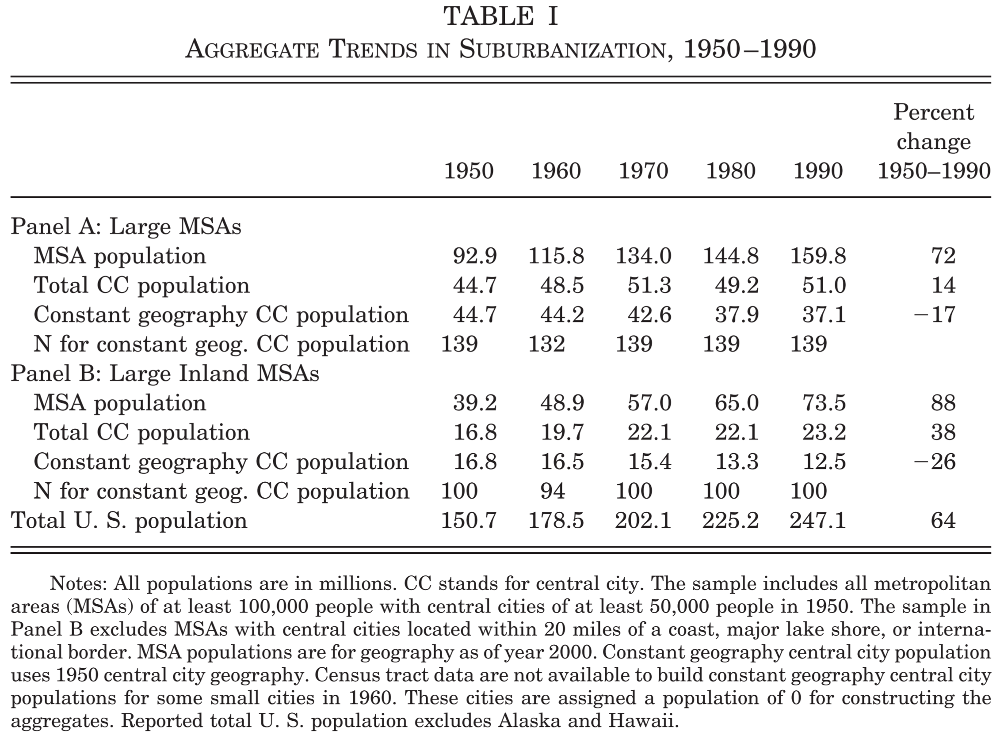
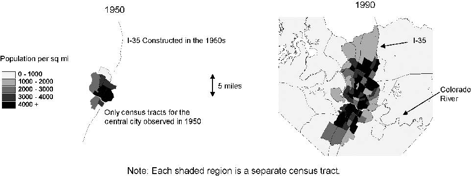
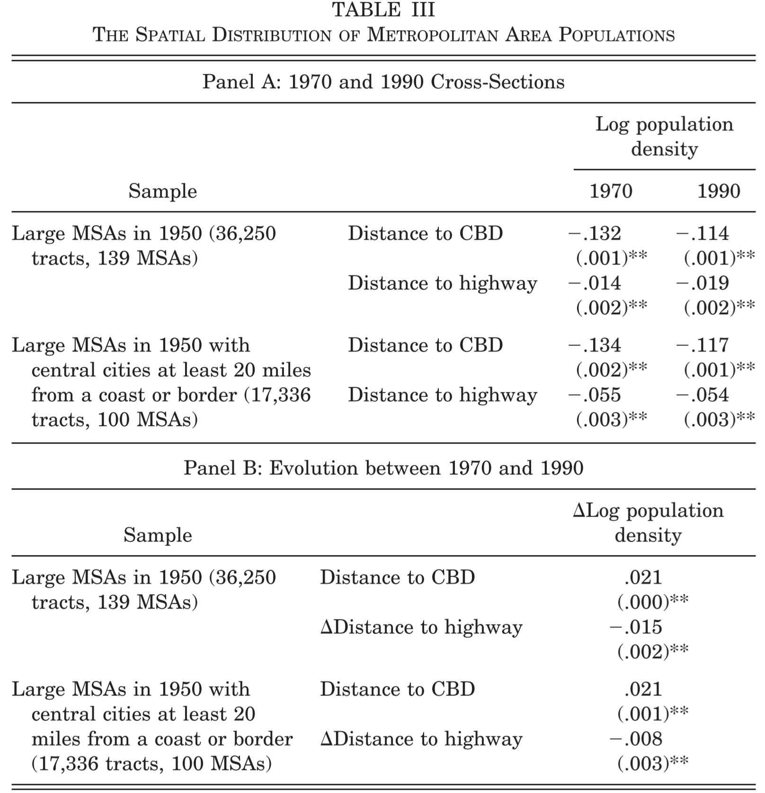
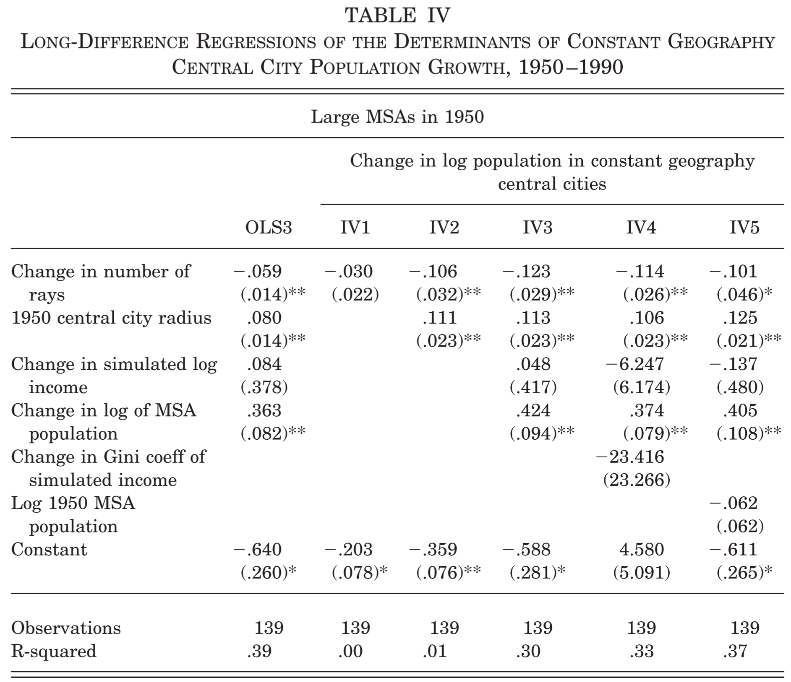
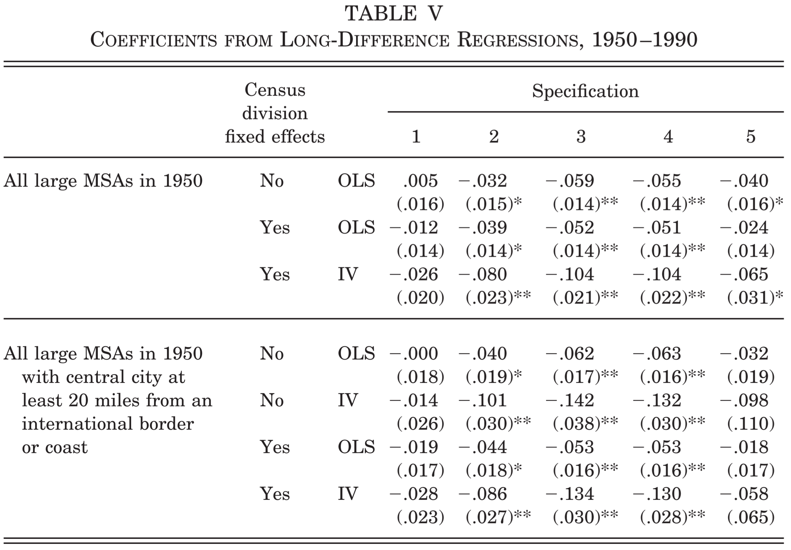
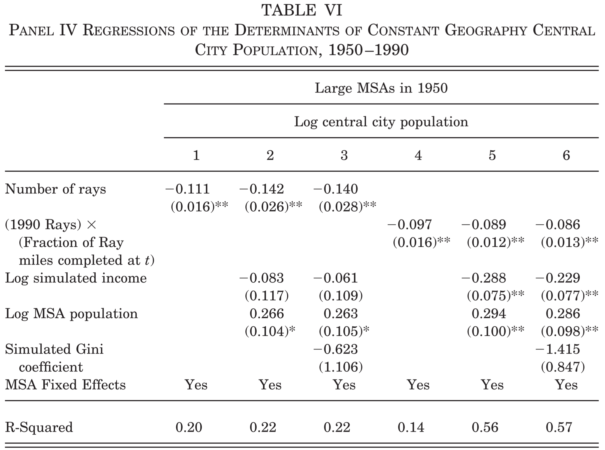

# Did Highways Cause Suburbanization?

> [Baum-Snow, Nathaniel. "Did highways cause suburbanization?." *The quarterly journal of economics* 122.2 (2007): 775-805.](https://doi.org/10.1162/qjec.122.2.775)

[toc]

---

> Abstract: Between 1950 and 1990, the aggregate population of central cities in the United States declined by 17 percent despite population growth of 72 percent in metropolitan areas as a whole. This paper assesses the extent to which the construction of new limited access highways has contributed to central city population decline. Using planned portions of the interstate highway system as a source of exogenous variation, empirical estimates indicate that one new highway passing through a central city reduces its population by about 18 percent. Estimates imply that aggregate central city population would have grown by about 8 percent had the interstate highway system not been built.

## Introduction

### Phenomenon and Findings

Between 1950 and 1990, the aggregate population of 1950 geography central cities in the United States declined by 17 percent despite population growth of 72 percent in metropolitan areas as a whole.

### Empirical Strategy

* This paper essentially compares rates of suburbanization in metropolitan areas that received many new highways between 1950 and 1990 to those receiving fewer during this period.
* In addition, I examine the extent to which highways can explain different rates of suburbanization across decades within MSAs.
* Identification: To account for the potential endogeneity of highway assignment, I instrument for the total number of highways built with the number of highways in a 1947 national interstate highway plan.

### Findings

* The construction of new limited access highways has contributed markedly to this central city population decline, and can explain about one-third of the change in aggregate central city population relative to metropolitan area population as a whole.
* This explanation is motivated by the land use theory developed by Alonso [1964], which predicts that faster commuting times push up the demand for space in suburbs relative to central cities.
* Had the interstate highway system not been built, instead of declining by 17 percent, aggregate central city population would have grown by 8 percent.

Some stylized facts:

* Constant geography central city population fell significantly faster than central city population within political boundaries.
* Large inland MSAs saw sharper declines in central city population than all large MSAs despite their faster total MSA population growth.

## The Interstate Highway System

### History

* The first codified federal involvement in developing a national highway system came with the Federal Aid Highway Act of 1944. The legislation stipulated that highways in the planned system should be “... so located as to connect by routes as direct as practicable ... to serve the national defense...”
* The 1944 highway act does not mention anywhere that these highways should be designed to serve local commuting.
* Most highways that existed in 1956 and ended up as interstates were in the plan but funded with state-issued bonds to be paid off with toll revenues. The 1956 plan incorporated some highways primarily meant for local commuting.

### The Primary Highway Measure: Rays

A “ray” is defined as a segment of road that connects the central business district (CBD) of the central city with the region outside the central city. If a highway passes through the central city, it counts as two rays whereas if a highway terminates in or near the central city it counts as only one.

### Endogeneity Concern

The fact that some urban highways were built without federal funding is evidence that state and local governments adjusted metropolitan area highway infrastructure at least partly in response to local commuting demand. That states constructed the urban sections of their planned federally funded highway system earlier than sections in rural areas is further evidence to this effect.

* In long difference regressions, the number of rays in the 1947 plan instruments for actual rays constructed between 1950 and 1990.
* In panel regressions, I instrument for the stock of highways with the (potentially fractional) number of rays that would have existed in each year had state governments allocated federally funded highway construction uniformly across federally planned interstate highways within their jurisdictions.

### Data

* Data for counties and central cities are taken from the County and City Data Books and aggregated to form MSAs.
* I hold MSA geography constant over time using definitions from 2000, the end of the study period, so as to keep total MSA population as comparable as possible over time.
* I relegate all but the largest central city in each MSA, based on 1950 population, to be part of the suburbs, in order to facilitate inclusion of central city data from 1950 in the analysis.
* Over half of the central cities in the sample annexed land over time as their populations decentralized.
  * Solution: I used printed census maps from 1950 to match digital maps of 1970 and 1980 census tracts to 1950 geography.

## Highways and the Spatial Distribution of Residences

### Land Use Theory

The land use theory first developed extensively by Alonso [1964], Mills [1967], and Muth [1969] proposes a mechanism by which improvements in the transportation infrastructure may cause suburbanization. In its simplest form, this theory assumes all employment occurs at a central location and the rental rate of land adjusts as a function of distance from the center to compensate for different commuting times of identical agents.

The introduction of a new highway ray results in an outward shift in the supply of land available for a given commuting time in a section of the city. This causes the equilibrium rental rate of land to fall throughout the metropolitan area, thereby reducing the population density through a price effect. Since the average commuting distance falls, individuals’ income net of commuting cost rises. If space is a normal good, a new ray thus further reduces population density, and by extension central city population, through an income effect.

Three implications:

* Population in metropolitan areas should spread out along new highways;
* Central city population should increase with metropolitan area population and the radius of the central city;
* Central city population should decline with the number of highway rays.

A more systematic description of the residential structure of metropolitan areas:

$$\log P_{ij}=a_i+\beta dis_{ij}^{cbd}+c\;dis_{ij}^{hwy}+\varepsilon_{ij} \tag{1}$$

## Results

This section presents estimates of the causal effect of highways on central city population growth.

### A. Long Difference Estimates

Equation (2) details the primary specification used in estimating the effects of highways on suburbanization.

$$\Delta \log N_i^c = \delta_0+\delta_1\Delta ray_i + \delta_2r_{ci} + \delta_3\Delta \tilde{w}_i+\delta_4\Delta\log N_i^{MSA}+\delta_5\Delta\tilde{G}_i+\varepsilon_i \tag{2}$$

* The inclusion of population and characteristics of the income distribution as controls in the regressions is intended primarily as a check on the exogeneity of the plan. If the plan is exogenous, the estimated effect of highways should not change with their inclusion.

* Coefficients on rays in all specifications have the expected negative sign and are usually statistically significant and sizable.
* As is predicted by land use theory, the coefficients on central city radius and metropolitan area population growth are positive.

Table V presents results using the same specifications as Table IV, for an additional more select sample and with the inclusion of census division fixed effects.

* The coefficient on rays remains consistent and robust;
* Selecting the sample slightly strengthens the estimated effect -- consistent with predictions from a land use model in which the space where the metropolitan area can expand is exogenously restricted.

### B. Panel Estimates

* The fact that the IV results are similar for the two different highway measures supports the claim that measurement error is the likely culprit to explain the small OLS coefficients for discrete rays. If accurate, this story implies that serial correlation in central city population growth rates could generate a spurious relationship between the plan and central city population growth rates after 1950.

### C. Additional Robustness Checks

#### The validity of IV

* It is still possible that the number of rays assigned in the 1947 highway plan may have been developed in response to central city decline in the early part of the 20th century;
* Alternatively, the 1947 plan could have been developed in response to very good forecasts about future commuting demand.

Falsification exercise: examining the extent to which we can predict changes in central city population between 1910 and 1950 using the 1947 plan.

* Regressions analogous to those reported in Table IV absent the income variables and using rays in the 1947 plan as an instrument for future construction yields a statistically insignificant coefficient of -0.003.

#### The endogeneity of MSA population

Considering a system of cities requires endogenizing MSA population. A model incorporating a system of cities suggests that holding the infrastructure in all other cities constant, more rays would attract new migrants to a city because they would cause the equilibrium utility level to increase.

Thus, the effect of a ray on central city population, holding MSA population constant, should be larger in magnitude than the effect if it is allowed to vary due to migration. That is, accounting for endogenous MSA population should increase the magnitude of the estimated effect of highway rays on central city population.

Solution:

* IV: Following Glaeser, Kolko, and Saiz [2001], I instrument for population growth between 1950 and 1990 with mean January temperature and annual precipitation in the central city;
* Measure suburbanization as log central city population share.

## Conclusions

This paper uses unique data to estimate the effect of new highway rays on suburbanization using a 1947 plan of the interstate highway system as a source of exogenous variation.

Taken together, long-difference and panel results imply an effect of one new highway ray on the change in log constant geography central-city population of about -0.09.

I evaluate the importance of highways for explaining central city population decline by examining the counterfactual evolution of aggregate central city population where no highways were constructed.

* A coefficient of -0.09 implies that had the interstate highway system not been built, aggregate central city population in MSAs in the primary sample would have increased by 8 percent between 1950 and 1990.

Potential mechanism: new highways allow firms to move to the suburbs.

* Indeed, urban employment decentralization was more rapid than residential decentralization between 1950 and 1990.
* In addition to chasing suburbanizing workers, firms may have relocated because highways free manufacturing firms from shipping through a port or downtown rail hub or because highways allow local agglomeration economies to operate over longer distances.
