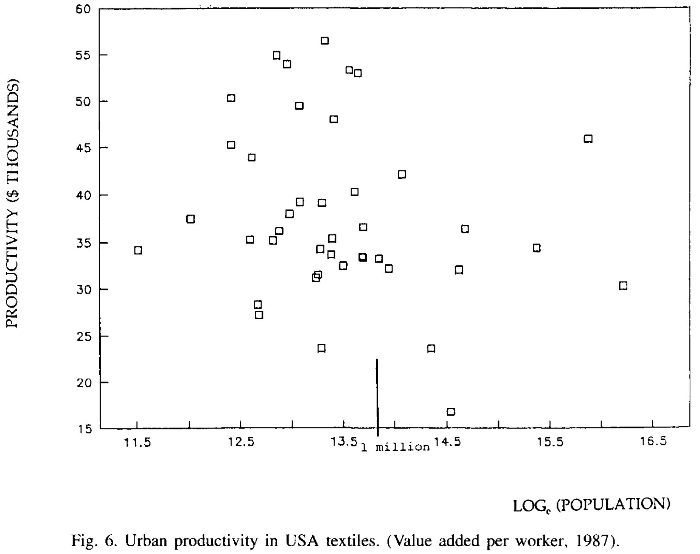

# Medium Size Cities

> [Henderson, Vernon. "Medium size cities." *Regional science and urban economics* 27.6 (1997): 583-612.](https://doi.org/10.1016/S0166-0462(96)02169-2)

[toc]

---

> Abstract: This paper investigates the role of medium size cities in economies, drawing on the experiences of Brazil, Japan, Korea, the USA and other countries. The paper argues that city size distributions are stable over time and that medium size cities are highly specialized, particularly in manufacturing activities, compared to metro areas. The relationship between medium size cities and metro areas is explored, examining issues of industrial suburbanization, the product cycle, edge city formation, and the advent of information technologies.

## Medium-size cities as a sector of the economy

In this section, we start off by showing that the size distribution of cities may be stable over time for an economy, even a rapidly growing one. We also take a preliminary look at the types of products which medium-size cities tend to produce, in comparison with much larger cities.

### The size distribution of cities

In Tables 1-3 we look at the city size distributions for the USA, Brazil, and Japan over time.

USA: Between 1970 and 1990 there was a modest reallocation of population from larger urban places (over 0.5 million) to medium-size ones (50,000 to 0.5 million).

Brazil: The major change is a reduction in the share of metropolitan areas over 500,000, with associated gains in all other categories. Certainly rapid economic development did nothing to diminish the role of medium-size cities.

Japan: Over 30 years, the main change is the dramatic increase in the role of medium-size cities (100,000 to 0.5 million) at the expense of smaller ones.

Note: One item Tables 1-3 do not deal with concerns the decentralization of the population of very large metropolitan areas into adjoining or nearby satellite cities. Sometimes these satellite cities are represented as separate (medium-size) cities if they are far enough from the core metro area. Other times they are still within the counties of the metro area and still defined as part of the metro area. In the USA, these satellite cities are sometimes referred to as "edge cities." They are distinct from bedroom suburbs, in that edge cities are economically self-contained, providing jobs and shopping for residents.

* For both the periods 1970-1980 and 1980-1987, population growth rates in the suburbs far exceeded those in the central cities.
* As we move out from the center of the central city, employment growth rates escalate.

An example of this in a developing country context, where satellite cities are identified, is given for Seoul, Korea.

* Particularly between 1970 and 1980, the satellite cities have grown at a tremendous rate, far faster than Seoul.
* Employment overall and in manufacturing in particular also decentralized between 1970 and 1980 from Seoul to the rest of Gyeonggi Province.

### Production patterns

Principle:

In general, production of standardized traditional items tends to be more heavily concentrated in smaller and medium-size cities, while production of less standardized or non-traditional items tends to be relatively more concentrated in larger cities.

* Metro areas under 500,000 have relatively bigger employment shares of traditional items such as textiles (36%), food processing (55%) and pulp and paper (53%).

## Production patterns of medium-size cities

Main idea: Medium-size cities tend to be highly specialized in their production patterns, in terms of goods ***exported*** from the city.

With development and urbanization, many medium-size cities specialize in modern manufacturing activities, while some others continue with traditional activities. The relative shift in medium-size city activities reflects **changes in the composition of national output with economic development and urbanization**, as the economy shifts from traditional (non-durable food and textiles) to modern (durable metals and machinery) manufacturing.

This section focuses on

* the fact that medium cities are highly specialized in production;
* the reasons why specialization occurs;
* the relationship between city size and product specialization.

### The degree of specialization

E.g.1 Brazil

Henderson (1988) examines data for southern Brazil for 1970. Findings:

* Out of 126 urban areas, the majority typically have absolutely zero employment in any one particular three-digit manufacturing activity and most of the rest have minimal employment in any one activity ( < 150 workers).
* Significant employment in any industry tends to occur in heavy concentrations in a few locations.
* For all urban areas, employment over 3,000 occurs in only 18 instances for modern durable good manufacturing, as opposed to 25 instances for more traditional manufacturing.

E.g.2 USA

The same findings...

* Roughly half of the 243 USA metro areas as highly specialized in one particular activity. These metro areas have up to 36% of their labor forces engaged in just the one cited activity.
* Except for the above, 22 small-medium size metro areas were specialized in providing college education and state government services.

This section mainly target two industries:

* traditional textiles (excluding apparel);
* high-tech instruments.

Textiles

* Most of these textile producers are medium or small-size metro areas.

Instruments

* Most metro areas record zero shares in instrument employment, but two cities under 1 million report very high instrument concentrations.
* Very large metro areas record small shares.

This representation of significant employment shares in both small and large cities in a high-tech industry is typical of a **developing industry**.

* Larger cities engage in production activities related to research and development and output of more experimental lines of products.
* Smaller metro areas produce standardized, fully developed product lines.

### Why is there specialization?

Ans: economies of scale at the level of the industry in a city.

* exchange of information
* a better diversity and quality of these locally provided services to an exporting industry
* efficiency of internal industry interchange

Recent empirical work suggests a further type of effect, based on the historical local environment, and labeled dynamic externalities.

* Dynamic externalities involve information spillovers among firms concerning the spread of knowledge to producers and the spread of knowledge within the research sector itself.
  * Information spillovers are very localized, diffuse slowly, and overwhelmingly occur in the same industry. That is, there is location specific knowledge--knowledge initially available only in a specific location that spreads slowly over space. To learn about the useful inventions of yesterday, firms must go to these hot spots of inventive activity.

Conclusion: cities also specialize over time. Past activity in an industry augments present activity.

### Implications for urban area sizes and production patterns over time

Why do cities have stable different sizes? Economies of scale in production v.s. Diseconomies of scale in agglomerating more and more economic activity into a single location.

* Cities specialized in products with higher degrees of scale economies will be larger, "on average."

The second issue concerns persistence in production patterns over time.
$$\log(1987\;employ\;in\;industry\;i\;in\;city\;j) = \alpha+\beta\log(1970\;employ\;in\;industry\;i\;in\;city\;j)+X_j\gamma+E_j$$

### Comparison with large metro areas

In the USA in 1987, none of the 25 metro areas with over 1.5 million people had 23% or more of their labor force in manufacturing.
Yet of 200 metro areas smaller than 1.5 million, about 45 had at least 23% of their labor force in manufacturing with some others over 30%, or even 40%.
Large metro areas tend to be more service oriented.

* Heavy concentrations of manufacturing are in medium-size cities.

When large metro areas engage in manufacturing they tend not to concentrate but to have very diverse manufacturing bases.

Define the Herschman-Herfindahl index for metrp areas in USA
$$HHI_j=\sum_{i=1}^{20}S_{ij}^2, $$

where $S_{ij}$ is the share of industry $i$ in manufacturing employment in city $j$.

The decline in HHI, or decline in concentration as metro area size increases is obvious.

* In comparison to medium-size cities as a set, no large metro areas have a very high degree of manufacturing activity and their manufacturing bases are diverse.

Korea case

* Fig. 5 contains one visible result, the rather low productivity of manufacturing in the largest metro areas.
* Second, a review of the data indicates that high productivity figures occur in medium-size cities concentrated in manufacturing.

USA cases: textile and instrument industry

So, the question is: why is some manufacturing still found in very large metro areas?

There are at least two general types of manufacturing activity found in large metro areas. Both require large local diverse labor and product markets to thrive.

* First a city like New York, Paris, or Tokyo contains significant employment in the arts, publishing, and high fashion apparel. These are volatile markets, where trends are set and broken, and products are tested locally. They experience significant scale economies connected with urban area size, not just industry size.
* Second, R&D activities require a very diverse and alive environment, where ideas flow freely across firms. R&D in one industry draws upon ideas in other industries, as well as in academic research environments.
* Moreover, R&D firms require very specific skilled employees for very specific developments, so they want to hire in a large diverse local labor market. Very different types of research activity agglomerate in a large metro area to cross fertilize and interact with an academic research community.

Result: corporations carry out their research activities in large metro areas, but relegate standardized production to more decentralized locations.

## Relationships among cities

### Satellite cities of large metro areas

Large metro areas in the last 20 years have decentralized to the extent that major satellite cities have sprung up on metro area fringes. These cities are selfcontained, providing jobs, homes, and shopping for residents.

Korea case: urban decentralization into satellite cities for Seoul

Some findings:

* First, between 1973 and 1981 there was employment decentralization from ring 1 outward for all industries, despite little or no population decentralization.
* Second, only publishing and to some extent the apparel portion of "textiles" retained significant employment in ring 1 in 1981.
* Finally, the heavier or more modern industries have much greater representation in rings 4 and 5 where the major satellite cities are located, than those rings' population shares.

While these firms had not decentralized to the rest of Korea by 1981, they had decentralized into satellite cities.

### Product cycle and incubator notions

The discussions of location of R&D activities and of employment decentralization are consistent with the product cycle theory:

* New products are developed through R&D and consumer tested in large sophisticated markets, where efficient R&D activity requires a diverse sophisticated labor market.
* Once a product is fully developed and production has become standardized, then mass production is decentralized to locations with cheap land costs (for large single story continuous process factories) and cheaper labor costs.

But product cycles apply at several spatial levels---decentralization into satellite medium-size cities within metro regions, decentralization of production from metro regions to hinterland mediumsize cities, and decentralization of production from first world cities to third world cities.

Metro areas in this product cycle are viewed as "incubators," where products are born and undergo early development.

Korea case

* Relocation of production facilities occurs disproportionately in satellite cities.

* Small firms tend to move short distances while larger plants move longer distances.

* For movers, the question is how far to decentralize.
  * The key concerns the extent to which the particular production activity is still tied to on-going product development.
  * E.g. Stages of production where components are experiencing greater product development will occur much closer to centers of R&D.

E.g. Japan's case of TV

* Headquarters and the basic consumer electronics laboratory are located in Tokyo.
* Within Japan, in other metro areas (Fukaya and Himeji), there is production of products currently undergoing major development.
* At the other extreme, production of standardized small and medium-size tubes for color TV's have been decentralized to Thailand, which exports to Toshiba plants in Singapore, Fukaya and worldwide.

### Developments in information technologies

## Conclusions

* Medium-size cities tend to be either service centers or manufacturing centers, in terms of goods produced for export outside the city.
  * Manufacturing centers produce standardized items.
  * Cities are highly specialized in these export products.
    * Specialization occurs because of economies of scale internal to the industry in a city.
* Large metro areas are very different.
  * First, they are more specialized in modern services.
  * Second, they are highly diversified in their remaining manufacturing bases, compared to specialized medium-size cities.
* Decentralized production patterns involve notions of product cycle and incubation.
  * How far production of components or assembly decentralizes depends on how standardized the item is and how labor intensive production is.
