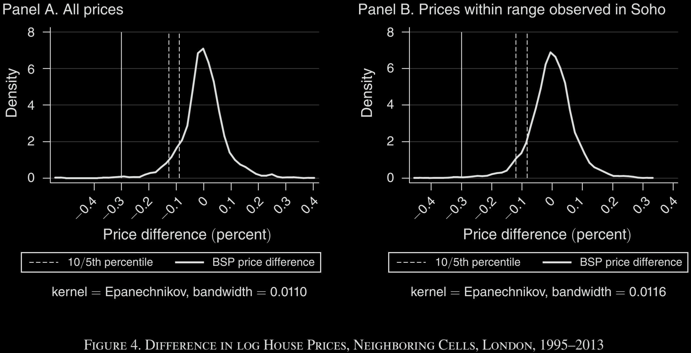

# Loss in the Time of Cholera

> Ambrus, A., Field, E., & Gonzalez, R. (2020). Loss in the time of cholera: Long-run impact of a disease epidemic on the urban landscape. *American Economic Review*, *110*(2), 475-525.

[toc]

---

## Authors

### Attila Ambrus

* Professor of Economics, Duke University

* **Research Interest**: Microeconomic Theory; Game Theory; Experimental Economics; Development Economics; Industrial Organization

* **Publication**: Top 5 (Except ECMA); Many JPubE; JET; …

### Erica Field

* Professor of Economics and Global Health, Duke University

* **Research Interest**: Development Economics; Labor Economics; Health Economics

### Robert M. Gonzalez

* Assistant Professor, Department of Economics, University of South Carolina

* **Research Interest**: The role of information-communication technologies (ICTs), the use of novel GIS data and methods to study conflict, crime, and public health…

---

## Research Question

Can disease exert a permanent effect on the geography of urban poverty?

### Common sense

* Residential migration will preserve the spatial distribution of income in the long run, erasing such shocks from the map over time.

Yet, in reality, **spatial discontinuities in urban land values are frequently observed** and **do not always appear related to discrete changes in local amenities**.

## Literature Review & Main Contribution

1. *A large literature in economic geography on the long-run persistence of income differences across space*:

> * There are a handful of papers that show evidence of persistent income differences across cities or towns even long after specific sources of economic advantage have become obsolete.
>
>   * Channels: changes in population growth that accompanied economic development or economic shocks; the path dependence that demographic trends created via economies of scale in industry; the lens of institutions …
>
>   * Not applicable within the parish setting, which constitutes a single economic and institutional environment.
>
> * **This paper's contribution**: provide an alternative means through which temporary and localized economic shocks can lead to long-term changes in the **spatial distribution of poverty**.
>
>   $\Rightarrow$ also broaden the channels of **residential sorting** through which we might observe persistent effects of historic shocks on the long-run economic growth of communities than has been considered in the literature.

2. *A large literature documenting and modeling neighborhood externalities in real estate values*:

> * Our findings also illustrate the potential economic cost of spatially correlated shocks when there are significant externalities from neighbors’ socioeconomic status;

3. *Our theoretical model is closely related to spatial models of location choice and segregation, but different*:

> * **First**, while agents in the models above follow simple behavioral rules, in our model they are fully forward-looking utility-maximizers;
>
> * **Second**, in our model rent-setting landlords coordinate the movement of tenants in and out of the block.
>
> * **Third**, instead of a self-contained city, our model features a block situated in an open world where tenants can move in and out.
>
> * **The focus of our paper is also different**: most of our focus is on characterizing the initial conditions under which the block converges to poverty.

4. Technically, our paper is related to asynchronous-move dynamic games, and the role of asynchronicity of moves in coordination problems.

---

## Background

We examine this question in the context of a cholera epidemic that hit a single urban parish of London in 1854.

> Over the course of one month, 660 residents living in the 0.5-mile radius of St. James Parish died from cholera, implying that roughly 5 percent of families were suddenly impoverished because of the loss of a potential wage earner.
>
> The outbreak was eventually attributed to contaminated groundwater that leached into one of the 13 wells serving the parish. As a result, the impact was concentrated in one particular neighborhood wherein a much higher fraction of families, 13 percent, experienced a loss.

* In this paper, we test empirically whether the cholera outbreak had a causal effect on neighborhood poverty, as measured by real estate prices, soon and long after the epidemic ended.

### Two main reasons for focusing on this particular event

1. Unique natural experiment: sharp changes in death rates at the boundary of the catchment area for the contaminated well, where other property attributes such as access to public goods can be assumed to change smoothly.

2. Very detailed microdata on deaths and property characteristics are available from this particular neighborhood at the time of the epidemic.

---

## Empirical Strategy

### A. Catchment Area Boundary

We define the catchment area according to a network Voronoi diagram of St. James, in which each of the 13 water pumps defines a point and the cells are determined according to the walking distance by road to each point.$\Rightarrow$

* The resulting catchment area has a total area of 0.07 square kilometers and a boundary of about 1,161 meters.

* 76 percent of cholera deaths occurred within the catchment area.

### B. RD Specification

Specifying a **one-dimensional** forcing variable: distance
$$y_{it}=\alpha+\gamma BSP_i+f(X_i)+\bold{W}'_{it}\beta+\epsilon_{it},\quad X_i<h,$$  where y is a measure of property value, BSP is dummy, $X_i$  is distance.

* Two types of $f(\cdot)$:

  * $f(X_i)=\delta_0X_i+\delta_1BSP_i*X_i$

  * $f(X_i)=\sum_{k=1}^K\delta_kX_i^k$

* Covariates: balance test

### C. Validity of RD Design

Examining the similarity across the boundary of neighborhood features, including rental price and neighborhood amenities.

$\Rightarrow$ Differences between catchment area and noncatchment area properties decrease significantly in magnitude, as expected.

---

## Results

### 1. Impacts on Cholera Exposure

### 2. Short-run Impacts on property prices

Houses inside the catchment area suffer a roughly 15 percent loss in rental value within a decade of the epidemic.

Sharp RD vs. Fuzzy RD:

* Treatment is not strictly defined by the BSP boundary (Table 3).$\Rightarrow$ Fuzzy RD
$$y_{it}=\alpha^f+\gamma^fBSP_{fuzzy,i}+f(X_i)+\bold{W}_{it}'\beta^f+\epsilon_{it},\quad X_i<h,\\
BSP_{fuzzy,i}=\delta+\tau BSP_i+g(X_i)+\bold{W}_{it}'\mu+\nu_{it},\quad X_i<h,$$ where $BSP_{fuzzy,i}=1$ if house $i$ experiences at least one cholera death.

Question here: why aren't estimates using fuzzy RD and IV exactly equivalent!

### 3. Short-run Impacts on other attributes

#### Migration

We anticipate that both impoverishment from cholera and also the change in the quality of the neighborhood would have driven residents out.

**Interesting things:**

* The exit is not just driven by mortality, but also neighborhood deaths. (Table 4)

* Two working effects: (一句话：没死人的家庭走了，死人的家庭留下来了)

  * Externalities from poor neighbors drive people away;

  * Rental price responses to neighborhood impoverishment increased the affordability of housing in affected areas.

#### Residential Crowding

### 4. Long-run Impacts on property prices & socioeconomic status

### 5. Robustness Checks

#### BSP Boundary Definition

* Using the alternative definition of the BSP catchment area boundary proposed by Snow (Snow 1855).

#### Falsification Tests

* It is possible that **cross-block price differences of the magnitude of our estimates are sufficiently common** (confound the boundary effect) in this setting to raise concerns about the validity of our interpretation.

$\Rightarrow$ **We examine the distribution of differences in average house prices** across neighboring cells of a grid covering the Greater London area.

* If sharp differences in prices across neighboring blocks are common, the differences across neighboring blocks within the bandwidth of our estimates should fall near the center of such distributions.

> **Three Steps:**
>
> **Step 1:** we overlay geocoded addresses on a grid covering the Greater London area with each graticule cell having a perimeter equal to Soho’s perimeter;
>
> **Step 2:** within each of these cells, we randomly draw 40 pairs of subcells with length equal to the optimal bandwidth used to calculate boundary effects on contemporary real estate prices (43 meters);
>
> **Step 3:** for each pair, we randomly assign one of the two subcells into treatment and calculate the average difference in log prices between treated and nontreated subcells for each Soho-sized cell.

### 6. Theoretical Framework

The empirical findings suggest a **“tipping” story**, according to which

* if a shock to a block is severe enough, it pushes it over a threshold, and the block tips into an equilibrium with relatively poorer tenants;

* if the shock is moderate, the block converges back to the original equilibrium.

#### Some features to exclude confounding channels

* The shock only directly affected people, not infrastructure;

* The small size of the affected area and that affected blocks are in close proximity and relatively intertwined with unaffected blocks;

* Apartments in the affected blocks were in the hands of landlords who by screening tenants via prices could potentially control the composition of blocks.

#### Three key elements of "Tipping"

> tipping的理解：稍微倾斜会恢复，倾斜过度就会倒。

* A block-level negative externality from living near poor neighbors;

* A higher willingness to pay to avoid this externality for the rich than the poor;

* Some friction that imposes a cost on landlords when they change tenants in a block.

> When the **frictions associated with changing tenants are not too small and the landlords’ discount factor is not too high**, although the landlords could make pricing decisions that would take back the block to its original tenant composition, if the initial shock is too severe, it would be too costly for them, and instead it is optimal for them to let the block transition to having poorer tenants.

* The main direct effect of the cholera epidemic was increasing the share of poor tenants in affected blocks through the death of wage-earners.

* There are contracting frictions (landlords have to wait until existing tenants’ contracts expire before kicking them out) and that in the meantime they have to offer discounts for rich tenants to be willing to stay in a block with poor neighbors.

---

## Reading Notes

> 一般认为，局部地理范围内的收入冲击只会影响一时，人口流动最终会抹平这种影响。然而在现实中，却经常可以观察到，相邻地区的土地价值长期存在差异。Attila Ambrus, Erica Field和Robert Gonzalez三位作者2020年在AER上发表的论文 Loss in the Time of Cholera: Long-run Impact of a Disease Epidemic on the Urban Landscape使用伦敦小范围瘟疫爆发的事件，检验了局部范围内的收入冲击对当地房价的长期影响及其形成机制。
>
> 1854年，伦敦爆发了一场小范围霍乱，造成当地大量居民死亡，霍乱的病原体来自水源，靠近受污染水泵的街区病情远比其他地方严重，于是作者利用空间模糊断点回归，考察了霍乱对房价的影响。首先，在短期内，霍乱显著降低了房价，居民迁出本地的概率下降，居民区变得更拥挤。利用1899年至2015年间不同时段的房价数据，作者检验了霍乱对房价的长期影响，发现当年靠近该水泵的街区仍然有着更低的房价，当地居住的穷人更多、富人更少。
>
> 随后，作者探索了这种长期影响的形成机制，一些家庭在霍乱中失去了劳动力，因此选择将房屋租给更多人居住，由此带来了拥挤等负外部性，让富人避之不及。作者用模型刻画了这一过程，相较于降低租金吸引富人入住，将房子持续租给穷人是房东的占优决策，于是从长期来看，房价错配、贫困集聚的情况再难逆转。
