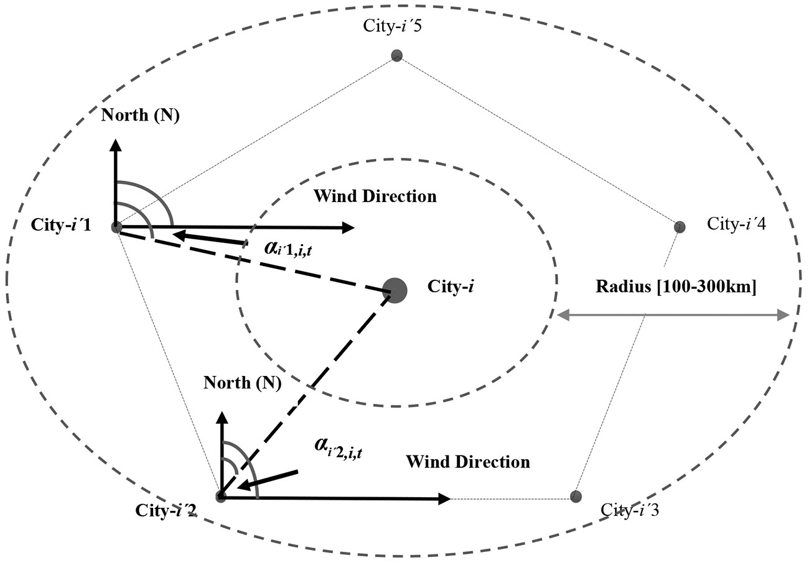
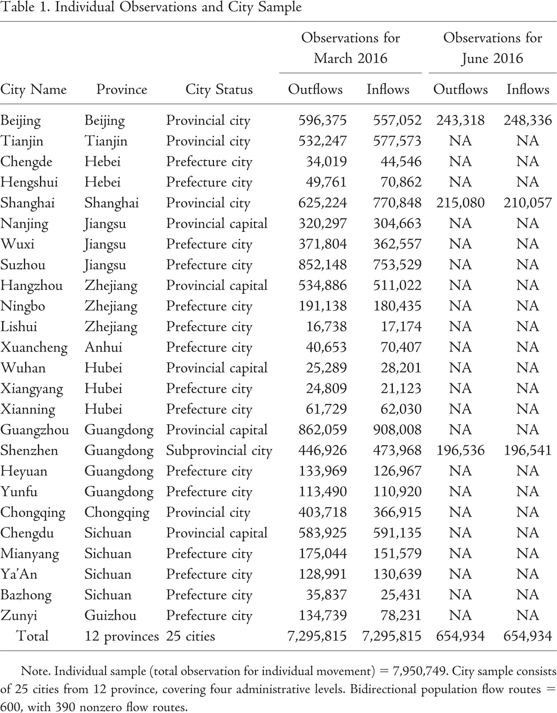
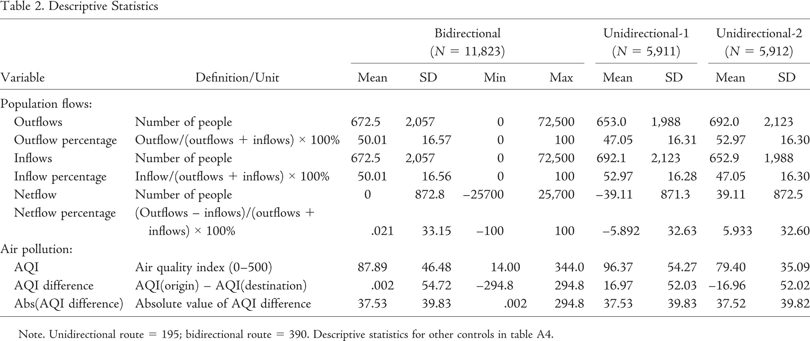
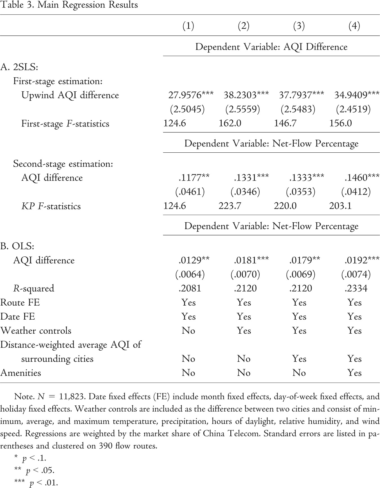
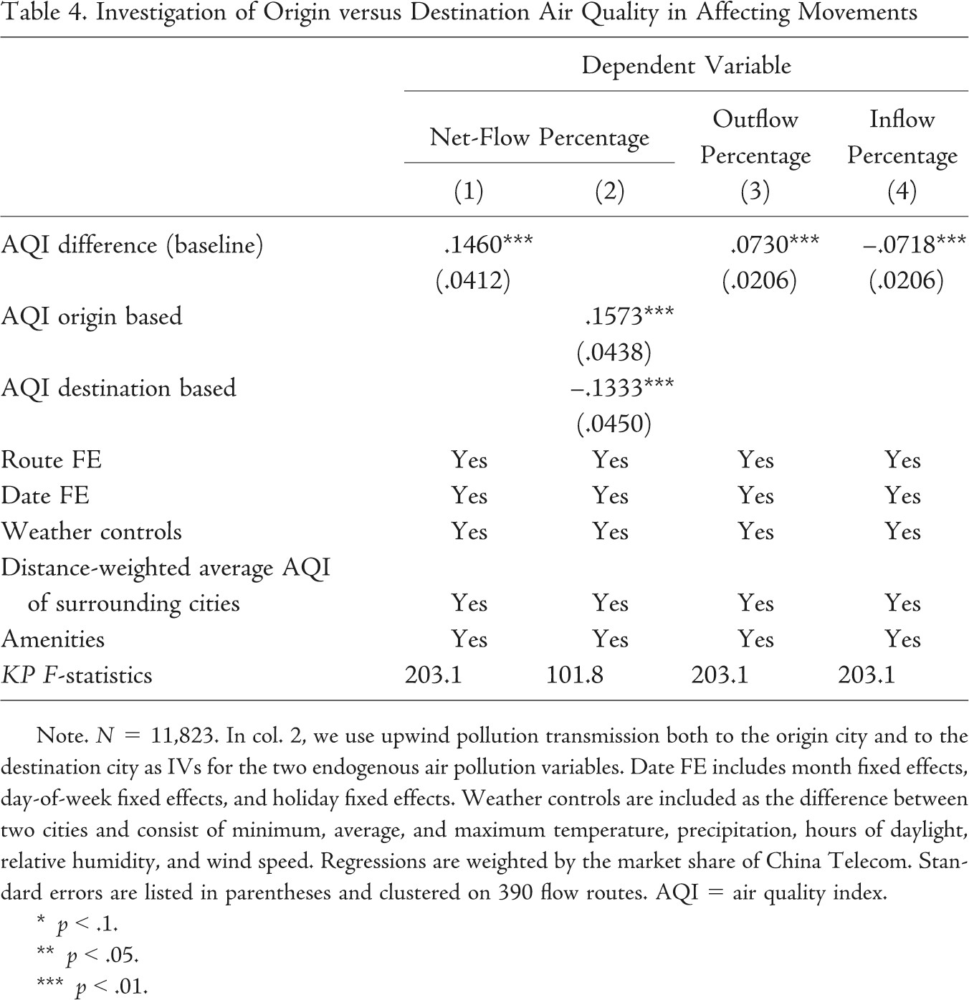
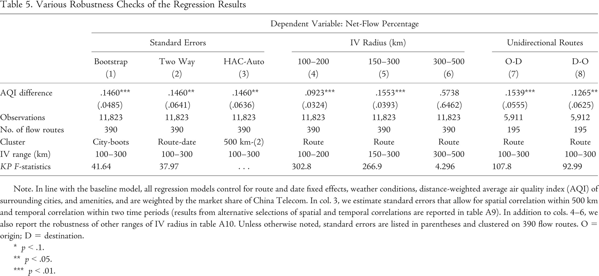
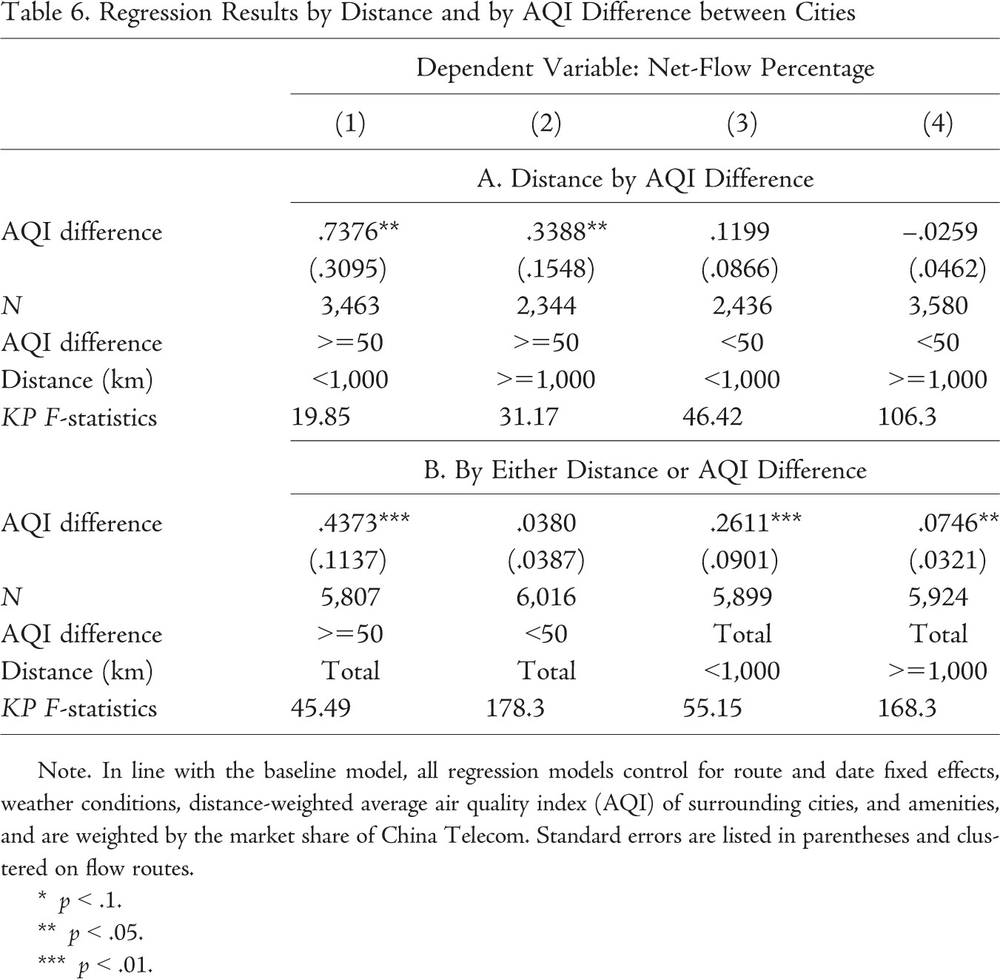
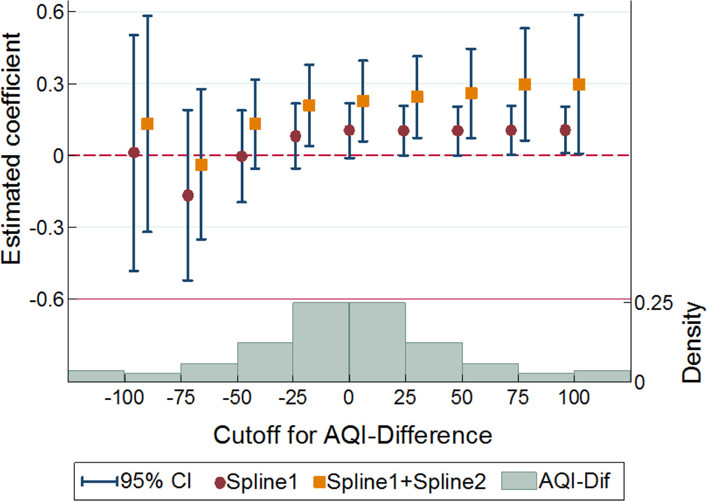
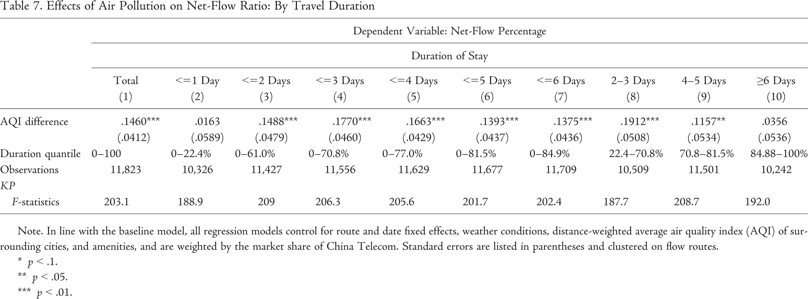
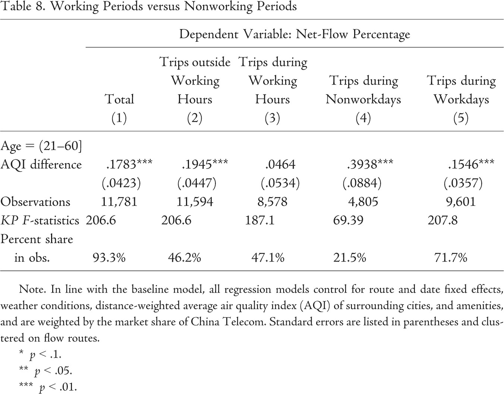

# Chasing Clean Air

> [Chen, Shuai, et al. "Chasing Clean Air: Pollution-Induced Travels in China." *Journal of the Association of Environmental and Resource Economists* 8.1 (2021): 59-89.](https://www.journals.uchicago.edu/doi/full/10.1086/711476)

[toc]

---

## Authors

### Shuai Chen

* Associate Professor, China Academy for Rural Development and the School of Public Affairs, Zhejiang University

* **Research Interest**: climate change, rural labor supply, air pollution, and human migration

* **Publication**: JEEM(2), …

### Yuyu Chen

* Professor, Guanghua School of Management, Peking University

* **Research Interest**: Ineqaulity, Human capital, health, Productivity and growth

* **Publication**: AER(2), JPE, PNAS, REStat, …

### Ziteng Lei

* PhD Candidate, Department of Economics, UC Santa Barbara

* **Research Interest**: labor economics, environmental economics, and applied econometrics

* **Publication**: JEG, …

### Jie-Sheng Tan-Soo

* Assistant Professor, Lee Kuan Yew School of Public Policy, National University of Singapore

* **Research Interest**: Ecosystem services valuation, Global environmental health and development, Pollution regulation in China

* **Publication**: PNAS, Energy Policy, JEG, …

---

## 1 Background

### 1.1 How literature tackles air pollution issues

* The first way is to **estimate the direct and indirect health impacts of air pollution**.

* The second way is to **derive a willingness-to-pay (WTP) measure for air quality improvements** using stated or actual behavioral responses.
  * Conduct contingent valuation method (CVM) study
  * OR rely on observed behaviors to value air quality
  > **One central difference** between these two strategies is that the latter relies on individuals actively responding to their surrounding air quality.

### 1.2 Averting behaviors

* **Migration:** Zheng and Kahn (2008); Bayer et al. (2009); S. Chen et al. (2017); Qin and Zhu (2018); Tan-Soo (2018); Freeman et al. (2019)

* **Purchases of face masks \& air purifiers, and health expenditures:** Cong Sun et al. (2017); Deschênes et al. (2017); Barwick et al. (2018); Zhang and Mu (2018); Ito and Zhang (2020)

### 1.3 Permanent migration v.s. short-run travel

* Patterns of **permanent migration** between locations are induced by their differences in air quality, among other factors (e.g., Sieg et al. 2004; Bayer et al. 2009; S. Chen et al. 2017; Tan-Soo 2018; Freeman et al. 2019).

* On the other hand, **short-term movements** on “bad days” can also be an appropriate travel-based avoidance response (Neidell, 2009; Graff Zivin and Neidell, 2009).
  * But only self-reported evidence from China.

### 1.4 What this paper does

**Idea:** Using mobile phones’ signal data from Telecom, this paper investigates the relationship between air quality differences and population movement between pairs of Chinese cities on any given day.

**Hypothesis:** At the daily level, there is a net flow of people moving from cities with poorer air quality toward cities with better air quality.

**Empirical challenge:** more pollution relates to more economic opportunities. $\Rightarrow$ underestimation

**Identification strategy:** long-range transmission of upwind air pollution as IV

**Further Work:** detect nonlinear relationships and decision-making mechanisms

### 1.5 Literature Contribution

1. This is one of the first studies to investigate how short-term movement is induced by locational differences in public goods.

2. Using short-term movement to value air quality confers an empirical advantage over using permanent migration as the former is motivated by a simpler decision-making process.

3. We take care to establish the causal relationship between air pollution and population flows.

4. We demonstrate empirically that all else being equal, places with clean air attract more visitors relative to places with more polluted air.

---

## 2 Model \& Empirical Strategy

### 2.1 Theorical Motivation

$$U=U(X,L,S) \tag{1}$$

where
$$S=S(P,Z).\tag{2}$$

* $X$: consumption of a unitaire good

* $L$: leisure time

* $S$: time spent sick

* $P$: ambient air pollution

* $Z$: other exogenous factors

Budget constraint:
$$I+wT_w=X+wL+c+M(S)+wS. \tag{3}$$

* $I$: nonlabor income

* $w$: wage rate

* $T_w$: total time endowment

* $c$: net cost of traveling (positive or negative)

* $M(S)$: medical expenses

The averting strategy here is a choice of location:

* $A=0$: staying in city $o$, $P=P_o$, $c=0$

* $A=1$: travel to location $d$, $P=P_d$, $c=c_d$

$$\max_{A,X,L} U=U(X,L,S) $$

$$s.t.\quad I+wT_w=X+wL+c+M(S)+wS; \tag{4} $$

$$S=S(P,Z); A\in \{0,1\}; P=P_o, c=0 \; if\; A=0;\\ P=P_d, c=c_d \; if\; A=1. $$

> Solve it in two steps:
>
> * First, independent of A, the individual maximizes utility by choosing consumption X and leisure L.$\Rightarrow V(I,w,S(P),c)$
>
> * Second, the individual now chooses $A$ (travel or not) to maximize utility. Choose to travel if $V(I,w,S(P_o),0)\leq V(I,w,S(P_d),c_d)$, and vice versa.

Suppose that the net travel cost of individual $c_d$ is varied for different individuals and follows a distribution with differentiable cumulative density function $F(c)$ with support $[\underset{-}{c},\bar{c}] $. By assuming

* (i) the probability of an individual in city $o$ willing to travel to city $d$ to be $Pr(Travel_{od})$,

* (ii) the population in city $o$ is $N_o$,

* (iii) the population in city $d$ is $N_d$,
the net-flow ratio for route $od$ is defined as:
$$NetFlowRatio_{od}=\frac{Flow_{od}-Flow_{do}}{Flow_{od}+Flow_{do}}=\frac{N_o\times Pr(Travel_{od})-N_d\times Pr(Travel_{do})}{N_o\times Pr(Travel_{od})+N_d\times Pr(Travel_{do})}.\tag{5} $$

We hypothesize that $\partial NF_{od}/\partial P_o\geq0,\partial NF_{od}/\partial P_o\leq0$

### 2.2 Empirical Strategy

$$NF_{ijt}=\beta_0+\beta_1(P_{it}-P_{jt})+(W_{it}-W_{jt})\theta+D_t+\gamma_{jt}+\phi_{ij}+\varepsilon_{ijt},\tag{6} $$

where $NF_{ijt}=(F_{ijt}-F_{jit})/(F_{ijt}+F_{jit}) $.

### 2.3 Instrumental Variable

It is likely that $P$ is positively correlated with economic activity ($E$), which in turn is a pull factor for incoming travelers. $\Rightarrow$ $\beta_1$ will likely be underestimated using OLS estimation.

Toward this end, we construct an IV based on **wind direction** and **long-range upwind transmission of air pollutants** (e.g., Bayer et al. 2009; Barwick et al. 2018; Tan-Soo 2018; Deryugina et al. 2019).

Following Barwick et al. (2018),
$$UP_{it}=\sum_{i'\neq i}\frac{P_{i't}\times WS_{i't}}{D^2_{i'i}}\times cos\theta_{i',i,t}\tag{7} $$

where
$$cos\theta_{i',i,t}=\max\{cos(\gamma_{i't}-\beta_{i't}),0 \}\tag{8} $$

For the exclusion restriction condition to be violated, the confounding variable(s) would need to vary at similar pulses as upwind locations’

* (i) distance to downwind location,

* (ii) daily air quality,

* (iii) daily wind direction,

* (iv) daily wind speed.

In this regard, the exclusion restriction condition may be violated in two ways:

* First, the upwind locations may share many similar characteristics (other than air quality) if they are too near to the downwind location for which they are instrumenting.

* Second, even though the set of cities instrumenting for say, city $A$ is weighted by distance, daily wind direction, speed, and air quality, it is still plausible that the set of instrumenting cities affect travels between city $A$ and city $B$ by being alternate travel destinations.

$$NF_{ijt}=\alpha_0+\alpha_1(\widehat{P_{it}-P_{jt}})+(W_{it}-W_{jt})\theta+D_t+\varphi_{ij}+\varepsilon_{ijt}\tag{6'} $$

where
$$(P_{it}-P_{jt})=\gamma_0+\gamma_1(UP_{it}-UP_{jt})+(W_{it}-W_{jt})\theta+D_t+\varphi_{ij}+\mu_{ijt}\tag{9} $$

## 3 Data

### 3.1 Data Sources

First, the raw data set for calculating population movement between cities is from China Telecom. China Telecom provided data of population flows between a group of cities (25 cities in March 2016 and three cities in June 2016), recording all flows of China Telecom mobile users between these given cities on a 24-hour basis.

The second source of data pertains to air quality. Air pollution data are obtained from the website of the China National Environmental Monitoring Center (CNEMC), which is affiliated with the Ministry of Environmental Protection of China (MEP).

Third, weather and climate data are obtained from the China Meteorological Data Service Center (CMDC), which is affiliated with the National Meteorological Information Center of China.

We match air pollution data and meteorological conditions from stations to Chinese cities using the inverse-distance weighting (IDW) method.

### 3.2 Descriptive Statistics

## 4 Results

### 4.1 Baseline Results

### 4.2 Origin versus Destination AQI

### 4.3 Robustness Checks

### 4.4 Nonlinear Responses

#### 4.4.1 Distance and Magnitude of AQI Differences between Cities

#### 4.4.2 Spline Regression

$$NF_{ijt}=\beta_0+\beta_1(\widehat{P_{it}-P_{jt}})+\beta_2\left[(\widehat{P_{it}-P_{jt}})-\kappa\right]\cdot I((P_{it}-P_{jt})\geq\kappa)\\ +(W_{it}-W_{jt})\theta+D_t+\gamma_{jt}+\varphi_{ij}+\varepsilon_{ijt}\tag{10}$$

### 4.5 Evidence on the Travel Decision-Making Process

#### 4.5.1 Duration of Stay

#### 4.5.2 Lead Air Quality at Destination

$$NF_{ijt}=\alpha_0+\alpha_1(\widehat{P_{it}-Lead_{j,t+k}})+(W_{it}-W_{jt})\theta+D_t+\varphi_{ij}+\varepsilon_{ijt}\tag{11} $$

where
$$(P_{it}-Lead_{j,t+k})=\gamma_0+\gamma_1(UP_{it}-UP_{jt})+(W_{it}-W_{jt})\theta+D_t+\varphi_{ij}+\mu_{ijt}\tag{12} $$

#### 4.5.3 Trips on Workdays v.s. Nonworkdays

## 5 Conclusion

### 5.1 Summary

This study utilizes a novel data set of telecommunication signals from China to examine an effective but understudied averting behavior—short-term travel to avoid air pollution.

For every unit difference in AQI between a pair of cities, movement to less polluted city increases by around 0.15%, which means around 5.7% of travel.

Further examination about decision making of avoidance travel:

* First, nearer destinations are more attractive than further ones.

* Second and related, nonlinear relationship between air quality difference and movements.

* Third, trips made on nonworking days and outside of working hours exhibit a stronger relationship with the AQI difference.

* Fourth, most avoidance travels last for more than 1 day and less than 4–5 days. Average marginal willingness to pay (MWTP) for AQI is at around CNY 6.4.

### 5.2 Limitation

* First, information used in this study is limited temporally and spatially as it is only available for 2 months—March and June—and for 25 cities.

* Second, the empirical strategy employed in this study is limited by the type of observations available.

* Third, to the extent that travel is multipurpose, the effect we have estimated may be overstated.

### 5.3 Research and Policy Implications

* First, we have taken a first look at how Chinese residents use short-term travel to avoid air pollution.

* Second, Our results shed additional light on the decision-making processes behind avoidance travels, including the spatial and temporal circumstances where they are more likely to be observed.
