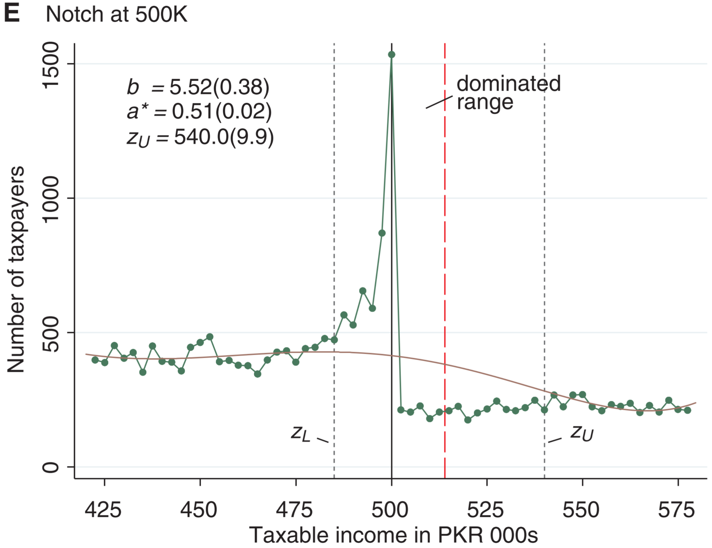
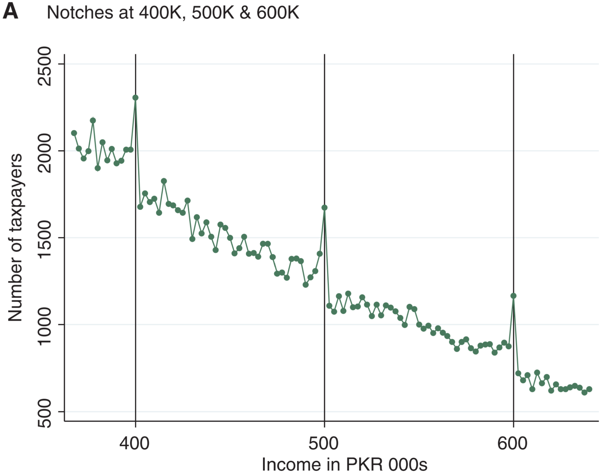

# **Using Notches to Uncover Optimization Frictions and Structural Elasticities:** Theory and Evidence from Pakistan

Henrik J. Kleven & Mazhar Waseem

---

## Introduction

---

* A central challenge in the literature on behavioral responses to taxes and transfers is how to estimate structural parameters when agents face optimization frictions such as switching costs, inattention, and inertia.
* This article develops a framework for **nonparametrically** identifying **optimization frictions** and **structural elasticities**.
* Notch is associated with a strictly dominated region above the cutoff where agents can increase both consumption and leisure by moving down below the cutoff.
* The dominated region should be completely empty in a frictionless world under any preferences, which implies that the observed density mass in this region can be used to measure attenuation bias from frictions.

---
**Main findings:**

* There is large and sharp excess bunching below every notch combined with missing mass (holes) above every notch.
* Even though observed bunching responses are large, those responses are strongly attenuated by optimization frictions.
* While the combination of large observed bunching and large frictions implies that the taxable income response to notches would be extremely large absent frictions, the underlying structural elasticity driving this large response is modest.
* We present evidence on the dynamics and determinants of optimization frictions.

---

## Theory and Empirical Methodology

---

### A model of Behavioral Responses to Notches

$$u=z-T(z)-\frac{n}{1+1/e}\left(\frac{z}{n} \right)^{1+1/e} \qquad \tag{1}$$

As a baseline, $T(z)=t\cdot z$.  F.O.C. $\Rightarrow$

$$z=n(1-t)^e \qquad \tag{2}$$

Denotation:

* Ability distribution: $F(n),f(n)$
* Counterfactual earnings distribution: $H_0(z),h_0(z)$
* Using (2), we have $H_0(z)=F(\frac{z}{(1-t)^e})$, $h_0(z)=H_0'(z)=f(\frac{z}{(1-t)^e})/(1-t)^e$

---
**Notch:** $T(z)=t\cdot z+[\Delta T+\Delta t\cdot z]\cdot 1[z>z^*]$.

* Given knowledge of notch parameters and an estimate of the earnings response $\Delta z^*$, it is possible to uncover the elasticity $e$.

---

Consider the marginal bunching individual who is initially located at $z^*+\Delta z^*$ and whose ability level we denote by $n^*+\Delta n^*$.

$$u^N=(1-t)z^*-\frac{n^*+\Delta n^*}{1+1/e}\left(\frac{z^*}{n^*+\Delta n^*} \right)^{1+1/e} \qquad \tag{3} $$

$$u^I=\frac{1}{1+e}(n^*+\Delta n^*)(1-t-\Delta t)^{1+e}-\Delta T\qquad \tag{4} $$

Since $u^N=u^I$ and $n^*+\Delta n^*=\frac{z^*+\Delta z^*}{(1-t)^e}$, we have
$$\frac{1}{1+\Delta z^*/z^*}\left[1+\frac{\Delta T/z^*}{1-t} \right]-\frac{1}{1+1/e}\left[1+\frac{1}{1+\Delta z^*/z^*} \right]^{1+1/e}\\-\frac{1}{1+e}\left[1-\frac{\Delta t}{1-t} \right]^{1+e}=0.\qquad \tag{5} $$

$$\Rightarrow e=e\left(\frac{\Delta z^*}{z^*},\frac{\Delta T/z^*}{1-t},\frac{\Delta t}{1-t}\right). $$

---

**Two important notes:**

1. The dominated range represents a lower bound on the earnings response to notches under any compensated elasticity in this frictionless model,
$$\lim_{e\to0}\Delta z^*=\frac{\Delta T+\Delta t\cdot z^*}{1-t-\Delta t}\equiv \Delta z^D \qquad \tag{6} $$
2. Settings with multiple notches are encompassed.

---

Determining $e=e\left(\frac{\Delta z^*}{z^*},\frac{\Delta T/z^*}{1-t},\frac{\Delta t}{1-t}\right)$ requires estimating earnings response $\Delta z^*$.

Excess bunching at the notch:
$$B=\int_{z^*}^{z^*+\Delta z^*}h_0(z)dz\approx h_0(z^*)\Delta z^*, \qquad \tag{7}$$

$\Rightarrow$ 4 extensions:

* Heterogeneity in elasticities
* Optimization frictions
* Dynamics
* Extensive responses

---

#### 1. Heterogeneity in Structural Elasticities

Settings: $\tilde{f}(n,e);\qquad \tilde{h}_0(z,e);\qquad h_0(z)=\int_e\tilde{h}_0(z,e)de\quad \Rightarrow$

$$B=\int_e\int_{z^*}^{z^*+\Delta z^*_e}\tilde{h}_0(z,e)dzde\approx h_0(z^*)E[\Delta z^*_e]. \qquad \tag{8} $$

---

#### 2. Optimization Frictions

* Ind. who would move to the notch point net of frictions stay above the notch; $\star$
* Ind. who do respond may not be able to target the cutoff precisely.

---

#### 2. Optimization Frictions(continue)

* Structural responses: the earnings response conditional on bunching;
* Observed responses: the actual earnings response given frictions.

Our notches framework can *separately estimate observed & structural elasticities.*

##### 1) Lower bound (bunching-hole method)

$a(z,e)$: the share of individuals unresponsive to the notch.

$$B=\int_e\int_{z^*}^{z^*+\Delta z^*_e}(1-a(z,e))\tilde{h}_0(z,e)dzde\approx h_0(z^*)(1-a^*)E[\Delta z^*_e], \qquad \tag{9} $$
where $a^*\equiv\int_{z^*}^{z^*+\Delta z^D}h(z)dz/\int_{z^*}^{z^*+\Delta z^D}h_0(z)dz.$

-- **Why lower bound?** Note that $a(z,e)$ increases on the bunching segment $(z^*,z^*+\Delta z^*_e)$. So $a^*$ understates average frictions and therefore the structural elasticity.

---

##### 2) Upper bound (convergence method)

An exact measure of attenuation bias from frictions requires us to know how much of the observed mass on the bunching segment $(z^*,z^*+\Delta z^*_{\bar{e}})$ can be explained by low elasticities in a frictionless world.

An extreme assumption is that none of it can be explained by low elasticities and that it is therefore all driven by frictions. This corresponds to an assumption of homogeneous structural elasticities at $e=\bar{e}$.

In this case, the structural response can be determined as the point of convergence between the observed and counterfactual distributions.

If there is heterogeneity in elasticities, this approach estimates the structural response by the highest-elasticity individuals and therefore represents an upper bound on the average structural response in the population.

---

#### 3. Dynamics and Career Concerns

In dynamic frameworks, current earnings may affect future wages through career concerns, learning by doing, etc. Assuming that the relationship between current earnings and future wages is continuous, the presence of career concerns reduces—but does not eliminate—the dominated range.

* Close to the lower bound $z^*$, it is still strictly dominated.
* At the upper bound $z^*+\Delta z^D$, this point is no longer strictly dominated.

Modification: estimating $a^*$ over smaller ranges $(z^*,z^*+\Delta z^D/K)$ where $K>1$.

---

#### 4. Extensive Responses

$$\Delta \bar{q}=u((z^*+\epsilon)(1-t),z^*+\epsilon)-u(z^*(1-t),z^*) \qquad \tag{10} $$

---

### A Reduced-Form Approximation of the Earnings Elasticity

Considering a proportional tax notch, the implicit marginal tax rate $t^*$ is given by
$$t^*\equiv \frac{T(z^*+\Delta z^*)-T(z^*)}{\Delta z^*}=t+\frac{\Delta t\cdot(z^*+\Delta z^*)}{\Delta z^*}\approx t+\frac{\Delta t\cdot z^*}{\Delta z^*}. \qquad \tag{11}$$

The reduced-form elasticity of earnings with respect to the implicit net-of-tax rate is then defined as
$$e_R\equiv \frac{\Delta z^*/z^*}{\Delta t^*/(1-t^*)}\approx \frac{(\Delta z^*/z^*)^2}{\Delta t/(1-t)}.  \qquad \tag{12} $$

The formula essentially treats the notch as a hypothetical kink creating a jump in the marginal tax rate from $t$ to $t^*$.

---

The bunching response to the notch $\Delta z^*$ overstates the bunching response that would be created by the kink $\Delta t^*$.--> **upper bound**.

---

### Empirical Methodology and Identification

Measures of bunching and missing mass will be based on a comparison between the empirical distribution and an estimated counterfactual distribution.

#### 1. Standard Case

$$c_j=\sum_{i=0}^p\beta_i\cdot (z_j)^i+\sum_{i=z_L}^{z_U}\gamma_i\cdot 1[z_j=i]+v_j, \qquad \tag{13} $$
where $c_j$ is the number of individuals in bin $j$. $\hat{c}_j=\sum_{i=0}^p\hat{\beta}_i(z_j)^i$.

$\hat{B}=\sum^{z^*}_{j=z_L}(c_j-\hat{c}_j)$, $\hat{M}=\sum_{j>z^*}^{z_U}(\hat{c}_j-c_j)$, $\hat{a}^*=\sum_{j\in D}c_j/\sum_{j\in D}\hat{c}_j$.

How to determine the excluded range $[z_L,z_U]$?

* $z_L$: determined visually
* $z_U$: using the condition $\hat{M}=\hat{B}$.

---

---

#### 2. Identification in the Standard Case

Three assumptions:

* The counterfactual distribution is smooth such that excess bunching $B$ identifies a behavioral response.
* Bunchers come from a continuous set $M=B$ above the cutoff such that there exists a well-defined marginal buncher.
* The degree of friction $a^*$ is locally constant and can therefore be inferred from the dominated region.

#### 3. Round-Number Bunching

$$c_j=\sum_{i=0}^p\beta_i\cdot (z_j)^i+\sum_{r\in R,12R}\rho_r\cdot 1[\frac{z_j}{r}\in N] +\sum_{i=z_L}^{z_U}\gamma_i\cdot 1[z_j=i]+v_j  \qquad \tag{14} $$

where $R=\{1K,5K,10K,25K,50K\}$.

---

## Application to Tax Notches in Pakistan

---

### Income Tax and Enforcement System

The personal income tax in Pakistan currently raises revenue of 1.1% of gross domestic product (GDP), or 11% of total tax revenue, and the share of registered taxpayers in the working-age population is less than 2%.

Notes:

* The tax rate on self-employed individuals increases from 0 to 25% over 13 notches, while the tax rate on wage earners increases from 0 to 20% over 20 notches (the first 13 of which are included in the figure).
* These notches create extremely strong incentives both because the average tax rate jumps are substantial and because they occur at high income levels.
* Average tax rates are substantially higher for self-employed individuals than for wage earners, which creates a different kind of notch.
* Tax schedules were fixed in nominal terms for self-employed individuals from 2006–2009 and for wage earners from 2006–2007 despite high inflation.

---

---

### Data

Our study is based on administrative data from the Federal Board of Revenue (FBR) in Pakistan, including the universe of personal income tax returns filed for the tax years 2006–2009 (about 4 million observations in total).

Some features:

* The universe of tax filers does not fully overlap with that of registered taxpayers.
* The population of tax filers is a high-income subsample of the general population.
* The population of tax filers is almost exclusively male (more than 99%).
* Self-employment is much more prevalent among taxpayers in Pakistan (about half of the sample) than in developed countries.
* Since our sample includes those who have selected into filing, they are likely to be a relatively tax-compliant subsample of the population.

---

### Results for Self-Employed Individuals

Self-employed individuals have a tendency to report taxable income in round numbers.

A two-pronged approach to deal with rounding:

* Split the sample by those who report income in even thousands (''rounders'') and those who do not (''non-rounders''), and separately analyze the continuous nonrounder sample (about 40% of filers).
* Consider the full sample of rounders and non-rounders, using the empirical specification (14).

---

**Non-rounders:**

---

**Some findings from the graph above:**

* Large and sharp bunching just below the cutoff, and missing mass above the cutoff
* No large holes in the distribution --> optimization frictions
* The area of missing mass is triangular
* The declining part of the empirical distribution features a step-function pattern --> potential multiple bunches; extensive responses; overshoot

---

**Main findings:**

* Excess bunching varies from **1.7 to 5.5 times the height of the counterfactual distribution**, strongly significant.
* Missing mass has a triangular shape and disappears to zero (point $z_U$) at about 35K–40K above each cutoff. This implies earnings responses of around **10% of income by the most elastic individuals**.
* Despite the evidence of large bunching and missing mass, behavioral responses are strongly attenuated by **optimization frictions**.
* Our findings imply that a majority of the population face **frictions** (such as adjustment or attention costs) of at least 2.5% of gross income.
* The amount of **bunching absent frictions** $b/(1-a^*)$ is two to seven times larger than observed bunching $b$.

---

**Full sample:**

---

---

---

**Main insights:**

* The total fraction featuring dominated behavior declines over time and more so for the balanced sample of repeat filers who accumulate filing experience annually.
* There is some persistence in dominated behavior from one year to the next, but almost everybody had moved out of such regions after three years.
* The total fraction featuring bunching behavior increases over time and features stronger persistence over time than dominated behavior.
* Tax rate misperception is much more widespread among those in dominated regions than among those in bunching regions, suggesting that misperception is a significant component of optimization frictions.
* Excess bunching becomes stronger and dominated behavior slightly weaker over the sample period.

---

---

**Main findings:**

* The estimated amount of friction is almost the same in the lower part of the dominated region as in the full dominated region. --> frictions are locally constant.
* Earnings responses are very large at all notches and always precisely estimated.
* The structural elasticities driving those large earnings responses are in general modest. --> 1) the mechanism design problem with notches; 2) observed elasticities is extremely close to zero.
* Elasticities are not as precisely estimated as earnings responses because of the strong nonlinearity of the formula that links the elasticity to the earnings response.

---

How to understand the smallness of structural elasticity estimates?

* The population of tax filers in Pakistan are relatively well monitored or have high tax morale, dampening the evasion channel of taxable income response to tax rates.
* Even if enforcement is weak and evasion therefore large, this does not necessarily imply a large evasion response to tax rate changes.
* Since we do not capture extensive responses (including informality) and potential discrete intensive responses between the interiors of brackets, we cannot conclude that the total elasticity of taxable income is necessarily small in Pakistan.

---

### Results for Wage Earners

---

**Main findings:**

* The empirical distribution features sharp bunching below every notch along with clear missing mass above every notch.
* The empirical distribution does not feature the step-function pattern observed for self-employed individuals, but a missing mass area that is flat or increasing after which the density is smoothly declining until the next notch.
* Bunching is not as large for wage earners as it is for self-employed individuals.
* Frictions are considerably larger for wage earners.

---

---

**Main findings:**

* The estimation of frictions is virtually unchanged as we zoom in on the bottom half of the dominated range, lending further support to the bunching-hole method based on the assumption of locally constant frictions.
* Most earnings responses are between 2%-5% of earnings across different notches.
* Those earnings responses are driven by very small structural elasticities, generally around 0.05 or lower.

---

### Shifting between Self-Employment and Wage Income

---

#### Findings from Panel A

* There is a clear behavioral response as the distribution features large excess mass on the low-tax side and large missing mass on the high-tax side of the notch.
* Bunching is more diffuse than seen earlier.
* Surprisingly there is excess bunching in the first bin above the notch.

#### Findings from Panel B

* Excess bunching equals 11.4 times the average height of the counterfactual distribution in the bunching range, but is not precisely estimated.
* The upper bound of the excluded range equals 87% and is precisely estimated, implying that the most responsive individuals reduce their self-employment income share by 37 percentage points.
* The notch size is also truly massive: the tax rate jump is on average 6%, considerably larger than the notches considered earlier.

---

## Conclusion

---

* Notches often create regions of strictly dominated choice that would be empty in the absence of optimization frictions, implying that observed density mass in such regions nonparametrically identifies frictions.
* By combining estimates of frictions and excess bunching at notches, it is possible to separately identify the observed elasticity attenuated by frictions and the structural elasticity absent frictions.
* Findings:
  * The quantitative importance of frictions
  * Absent attenuation bias from frictions, behavioral responses to notches are very large while the structural elasticities are in general modest.

---

